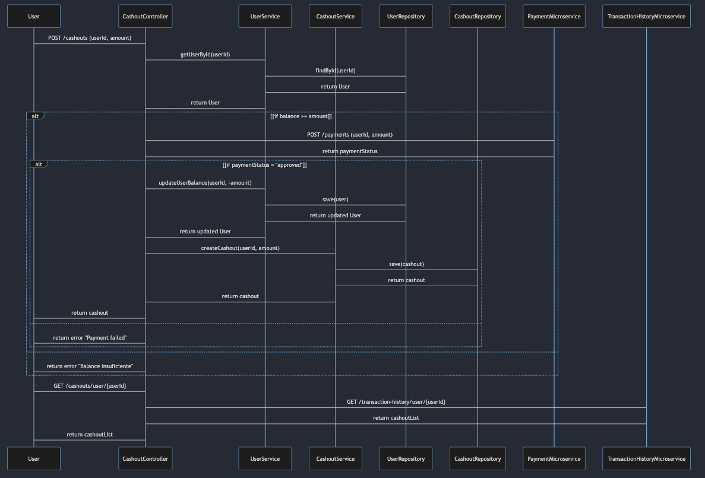

# reactor-cashout-workshop
Proyecto Final Cashout Workshop

## Descripción
Este proyecto es el resultado del trabajo realizado en el workshop, en el cual se implementó un sistema de cashout.

Este proyecto se realizando usando Java 17, Spring Boot y MongoDB.

## Requerimientos
- Java 17
- Gradle
- MongoDB


## Swagger
http://localhost:8080/swagger-ui.html

## Diagrama de Secuencia


## UserController

### Endpoints

#### `POST /user`
**Descripción:** Crea un nuevo usuario.

**Cuerpo de la solicitud:**
```json
{
  "name": "String",
  "balance": "Double"
}
```

**Respuestas:**
- `200 OK`: Devuelve el objeto `User` creado.

<hr>

#### `GET /user`
**Descripción:** Recupera todos los usuarios.

**Respuestas:**
- `200 OK`: Devuelve una lista de objetos `User`.
<hr>


#### `GET /user/{id}`
**Descripción:** Recupera un usuario por ID.

**Variables de ruta:**
- `id` (Long): El ID del usuario.

**Respuestas:**
- `200 OK`: Devuelve el objeto `User`.
- `404 Not Found`: Si el usuario no es encontrado.
<hr>

#### `PUT /user/{id}/balance`
**Descripción:** Actualiza el saldo de un usuario.

**Variables de ruta:**
- `id` (Long): El ID del usuario.

**Cuerpo de la solicitud:**
```json
{
  "balance": "Double"
}
```

**Respuestas:**
- `200 OK`: Devuelve el objeto `User` actualizado.
<hr>

### Métodos

#### `createUser`
- **Descripción:** Crea un nuevo usuario.
- **Parámetros:** `User user`
- **Devuelve:** `Mono<User>`
<hr>

#### `getAllUsers`
- **Descripción:** Recupera todos los usuarios.
- **Devuelve:** `Flux<User>`
<hr>

#### `getUserById`
- **Descripción:** Recupera un usuario por ID.
- **Parámetros:** `Long id`
- **Devuelve:** `Mono<User>`
<hr>

#### `updateBalance`
- **Descripción:** Actualiza el saldo de un usuario.
- **Parámetros:** `Long id`, `UpdateBalanceDto balance`
- **Devuelve:** `Mono<User>`


## CashoutController

### Endpoints

#### `POST /cashout`
**Descripción:** Crea un nuevo cashout.

**Cuerpo de la solicitud:**
```json
{
  "userId": "Long",
  "amount": "Double"
}
```

**Respuestas:**
- `200 OK`: Devuelve el objeto `Cashout` creado.
- `400 Bad Request`: Si el saldo del usuario es insuficiente o el pago falla.
- `404 Not Found`: Si el usuario no es encontrado.
<hr>

#### `GET /cashout/user/{userId}`
**Descripción:** Recupera todos los cashouts para un usuario específico.

**Variables de ruta:**
- `userId` (Long): El ID del usuario.

**Respuestas:**
- `200 OK`: Devuelve una lista de objetos `Cashout`.

<hr>

### Métodos

#### `createCashout`
- **Descripción:** Crea un nuevo cashout.
- **Parámetros:** `Cashout cashout`
- **Devuelve:** `Mono<Cashout>`
<hr>

#### `getCashoutByUserId`
- **Descripción:** Recupera todos los cashouts para un usuario específico.
- **Parámetros:** `Long userId`
- **Devuelve:** `Flux<Cashout>`